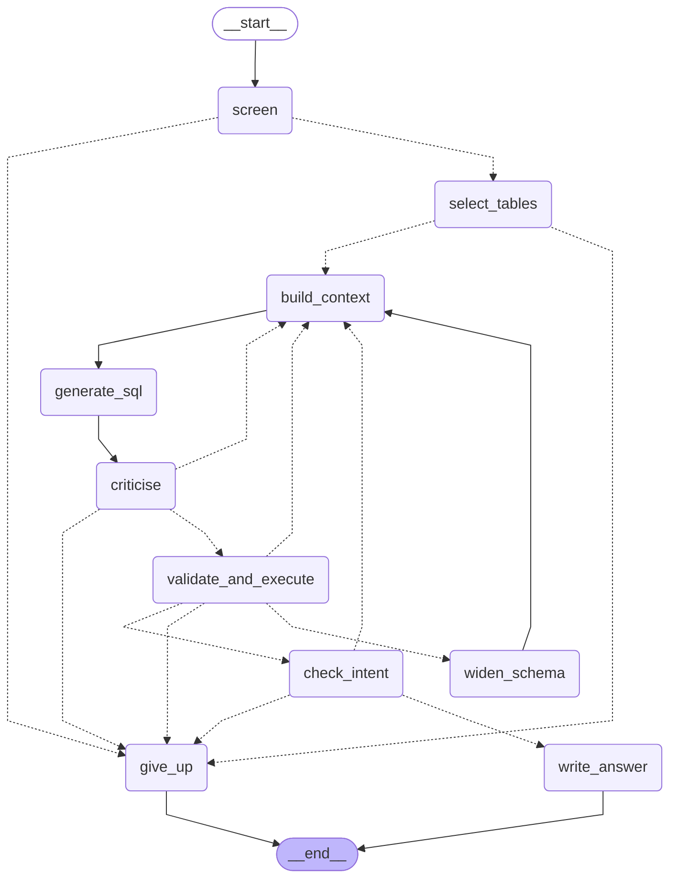

# The agent graph

Generated by `make graph` (`scripts/draw_graph.py`) from
`build_agent_graph()` in `src/sqlagent/agent_graph.py` via LangGraph's
`get_graph().draw_mermaid()`. Do not edit by hand; regenerate.

- **Solid arrow**: always taken.
- **Dotted arrow**: conditional, chosen by a routing function
  (`route_after_*` in `agent_graph.py`).
- Loops back to `build_context` / `select_tables` / `widen_schema` are the
  repair loops; `give_up` is the exit when the budget runs out or a question
  needs clarifying.

In Langfuse each node appears under a verb-first name: `screen` →
`screen-question`, `select_tables` →
`select-tables`, `build_context` → `build-schema-context`, `generate_sql` →
`generate-sql`, `criticise` → `review-sql`, `validate_and_execute` →
`execute-sql`, `check_intent` → `check-intent`, `widen_schema` →
`widen-schema`, `write_answer` → `write-answer`, `give_up` → `give-up`.

